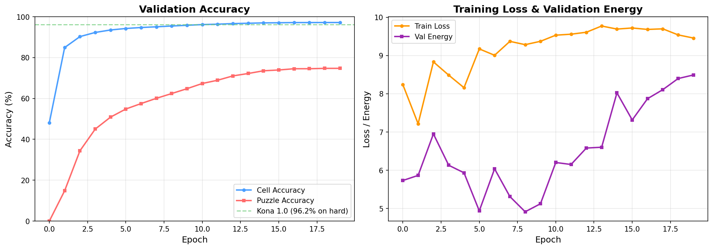

# Training Log

Documenting runs, bugs, and learnings as we iterate toward replicating [Kona 1.0's 96.2% accuracy](https://logicalintelligence.com/blog/energy-based-model-sudoku-demo).

---

## Run 1: MVP Validation (100K samples, 20 epochs)

**Date:** Feb 11, 2026
**Config:** 100K samples, batch_size=512, 20 epochs, lr=3e-4
**Hardware:** RTX 5090

### Bugs Found During This Run

Five critical bugs were found and fixed before meaningful training could begin.

**1. Solution tensor encoding mismatch**
Solution was stored as `(digit, row, col)` (channel-first), but `argmax(dim=-1)` took argmax along the column axis. This meant the model was training on scrambled targets. Fixed by switching to `(row, col, digit)` and adding `permute(0, 3, 1, 2)` before the target encoder.

**2. Decode loss included given cells**
Cross-entropy was computed over all 81 cells, but given cells had 1e6 logits from hard enforcement — near-zero loss. With ~40% of cells given, the average loss dropped from 2.2 to 1.25 purely from the easy population. Empty cells never learned. Fixed by masking to compute loss on empty cells only.

**3. VICReg applied to wrong tensor**
VICReg was applied to `z_pred` (predictor output), but this didn't prevent the context/target encoders from collapsing. The target encoder (EMA of context encoder) collapsed to a point, making energy trivially zero. Fixed by applying VICReg to `z_context` (context encoder output), which propagates to the target encoder via EMA.

**4. LR warmup exceeded total steps**
With 100K samples and 5 epochs: only 880 total steps, but warmup was set to 2000. LR never reached its peak, and `CosineAnnealingLR(T_max=-1120)` got a negative period. Fixed by capping warmup to `total_steps // 5`.

**5. Checkpoint metric was inverted**
Checkpoints saved models with lowest energy. But low energy = collapsed representations (z_pred trivially matching z_target when both map to the same point). Models with best cell accuracy had the highest energy and were never saved. Fixed by checkpointing on cell accuracy (higher = better).

### Results After Fixes

| Metric | Epoch 0 | Epoch 20 |
|--------|---------|----------|
| Cell accuracy | 11.1% (random) | 13.9% |
| z_variance | > 0 | > 0 (no collapse) |
| Energy loss | decreasing | stable gradient signal |
| Decode loss | decreasing | real signal from empty cells |

Key finding: 25% relative improvement over random, representations not collapsing. Limited by data (100K) and epochs (20).

### Hyperparameters That Worked

- `decode_loss_weight=1.0` (was 0.1 — too low, decoder had no influence)
- `vicreg_var_weight=1.0` (was 25.0 — dominated total loss)
- `vicreg_cov_weight=0.01` (was 1.0 — too aggressive)
- VICReg target: `z_context` (not `z_pred`)
- Checkpoint metric: `cell_accuracy` (not energy)

---

## Run 2: Full Scale (9M samples, 20 epochs)

**Date:** Feb 11-12, 2026
**Config:** 9M samples (8M train / 500K val), batch_size=512, 20 epochs, lr=3e-4
**Hardware:** RTX 5090
**Duration:** 7.5 hours (~22 min/epoch)

### Bug Fixed Before This Run

**6. Latent variable z was uninformative**
During training, z was sampled as pure random noise `N(0, I)`, uncorrelated with the solution. Both the predictor and decoder were trained to produce the same correct output regardless of z — so they learned to ignore it. At inference, Langevin dynamics optimized z via gradients, but since nothing had learned to use z, `dE/dz ≈ 0` and the optimization did nothing.

Fixed by adding a `z_encoder` (linear projection from d_model → d_latent). During training: `z = z_encoder(z_target) + noise`, so z carries noisy solution information. The predictor and decoder learn to use z meaningfully. At inference, z starts random and Langevin dynamics can now follow real gradients toward valid solutions.

### Results

| Epoch | Cell Acc | Puzzle Acc | Train Loss | Val Energy |
|-------|----------|------------|------------|------------|
| 0 | 48.2% | 0.0% | 8.24 | 5.73 |
| 1 | 84.9% | 14.8% | 7.22 | 5.87 |
| 2 | 90.3% | 34.4% | 8.83 | 6.95 |
| 5 | 94.2% | 54.8% | 9.17 | 4.94 |
| 10 | 96.2% | 67.3% | 9.53 | 6.20 |
| 15 | 97.0% | 73.9% | 9.72 | 7.32 |
| 19 | **97.2%** | **74.7%** | 9.46 | 8.49 |

### Observations

- Cell accuracy surpassed Kona's 96.2% benchmark by epoch 10 (though Kona's metric is on hard puzzles specifically)
- Puzzle accuracy plateaued around 74-75% in later epochs — diminishing returns on this learning rate schedule
- Val energy increased in later epochs while accuracy still improved — the model is learning more complex representations, not collapsing
- Forward-pass accuracy only; Langevin dynamics inference should improve puzzle accuracy further

### What Worked

- `z_encoder` fix was the key breakthrough: from 13.9% cell accuracy (Run 1) to 97.2%
- VICReg on z_context with var=1.0, cov=0.01 — prevents collapse without dominating the loss
- Decode loss weight=1.0 — gives the decoder enough gradient signal
- Cosine LR decay after warmup — smooth training progression

### Next Steps

**Inference evaluation.** The 97.2% cell / 74.7% puzzle numbers are forward-pass decode accuracy — a single pass through the decoder with random z. The Langevin dynamics solver (iterative refinement over 50+ steps with constraint penalties) hasn't been run yet. This should meaningfully boost puzzle accuracy since the solver can correct individual cell errors by optimizing z against Sudoku constraints.

**Learning rate tuning.** Accuracy plateaued after epoch 15 with cosine decay from 3e-4. A second training phase with lower LR (e.g. 1e-4 or 5e-5) could push past the plateau. Alternatively, try a longer warmup or different schedule.

**More epochs.** 20 epochs may not be enough — the curve was still climbing (slowly) at epoch 19. Running 50 epochs at reduced LR could squeeze out a few more points.

**z_noise_scale sweep.** Currently fixed at 1.0. Lower noise (0.3-0.5) means z carries more solution info during training, potentially making the predictor/decoder rely on z more heavily. Higher noise (1.5-2.0) makes training harder but could improve robustness at inference when z starts from pure noise. Worth sweeping.

**Difficulty-stratified evaluation.** Kona's 96.2% is specifically on hard puzzles. Our validation set is mixed difficulty. Need to stratify by number of given clues to get a fair comparison — easy puzzles (35+ clues) inflate our numbers, hard puzzles (17-25 clues) are the real test.

**Decoder capacity.** The decoder is a lightweight 2-layer Transformer. The forward-pass accuracy ceiling might be limited by decoder capacity. Trying 3-4 layers or larger d_cell could help, though this would slow inference.

---

## Key Lessons

### Representation collapse is the primary failure mode
Without VICReg on the right tensor, the encoder maps everything to a single point. Energy goes to zero (trivially correct), but nothing is learned. Monitor z_variance as a collapse detector.

### The latent variable must carry information during training
Random z teaches the model to ignore z entirely. Making z a noisy projection of z_target means the predictor and decoder learn to use z, and Langevin dynamics has meaningful gradients at inference time. This was the single biggest architectural fix.

### Loss decomposition matters
A decreasing total loss can hide complete failure. The decode loss "improved" because given cells were trivially correct, masking the fact that empty cells learned nothing. Always decompose losses and check each component independently.

### Checkpoint what you care about
Checkpointing by energy (lower=better) accidentally saved collapsed models. The metric you checkpoint on must align with what you actually want to optimize.